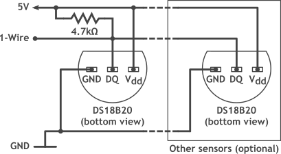

# Control LED from WEB

## Raspberry Pi and C.H.I.P.

### Prerequisites

- Configured and [connected](/#connecting-a-new-device) device.
- Breadboard, connecting wires, 330Ω..1kΩ resistor.

### Code

- Open the **control.py** sample file ([Raspberry Pi](https://github.com/cloud4rpi/cloud4rpi-raspberrypi-python/blob/master/control.py), [C.H.I.P.](https://github.com/cloud4rpi/cloud4rpi-chip-python/blob/master/control.py)).
- Replace `__YOUR_DEVICE_TOKEN__` with your personal device token from the [Device](https://cloud4rpi.io/devices) page.
- Connect an LED to a GPIO pin and set the correct value to the `LED_PIN` variable. The default pin is **GPIO18** (Pin 12) on Raspberry Pi and **XIO-P0** on C.H.I.P.
- Run `sudo python control.py`. A new variable named `LED On` should appear on the [Device](https://cloud4rpi.io/devices) page.
- Open the [Control Panels](https://cloud4rpi.io/control-panels/) page and add a new control panel.
- Add a new **Switch** widget and choose the newly added `LED On` variable.

You can now switch the LED state using this widget.

## Omega2

### Prerequisites

- Configured and [connected](/#connecting-a-new-device) Omega2 board.

### Code

- Open the [led.py](https://github.com/cloud4rpi/cloud4rpi-omega2-python/blob/master/led.py) sample file.
- Replace `__YOUR_DEVICE_TOKEN__` with your personal device token from the [Device](https://cloud4rpi.io/devices) page.
- Run `python led.py`. A new variable named `Omega LED` should appear on the [Device](https://cloud4rpi.io/devices) page.
- Open the [Control Panels](https://cloud4rpi.io/control-panels/) page and add a new control panel.
- Add a new **Switch** widget and choose the newly added `Omega LED` variable.

You can now switch the onboard LED state using this widget.

# Monitor Device Events using Colored Status

## Prerequisites

- Configured and [connected](/#connecting-a-new-device) device.

## Code

- Open the **control.py** sample file ([Raspberry Pi](https://github.com/cloud4rpi/cloud4rpi-raspberrypi-python/blob/master/control.py), [C.H.I.P.](https://github.com/cloud4rpi/cloud4rpi-chip-python/blob/master/control.py)).
- Replace `__YOUR_DEVICE_TOKEN__` with your personal device token from the [Device](https://cloud4rpi.io/devices) page.
- Run `sudo python control.py`. A new variable named `STATUS` should appear on the [Device](https://cloud4rpi.io/devices) page.
- Open the [Control Panels](https://cloud4rpi.io/control-panels/) page and add a new control panel or open an existing one.
- Add a new `Text` widget and choose the newly added `STATUS` variable.
- Change the pre-defined status color items according to the event names from the code above.
- As a result, you should have three items like the following:
`{ IDLE: #00ff00}  { RING: #ff6600}  { BOOM!: #ff0000}`

Now this widget displays incoming status with color.

# Connect DS18B20 Temperature Sensor

This example shows how to use the [DS18B20](https://datasheets.maximintegrated.com/en/ds/DS18B20.pdf) temperature sensor with the Cloud4RPi service.

## Prerequisites

- Configured and [connected](/#connecting-a-new-device) device with 1-Wire support.
- [Enabled](/#prerequisites) 1-Wire interface (in case of Raspberry Pi or similar platforms).
- Breadboard, connecting wires, pull-up resistor (4.7kΩ).

## Schematics

- Connect the **GND** pin to any GND output of your board.
- Connect the **Vdd** pin to 5V or 3.3V output of your board.
- Connect the **DQ** pin to the pull-up resistor and the resistor to **Vdd**.
- Connect the **DQ** pin to the 1-Wire pin of your board:
    - Raspberry Pi: The default pin is **GPIO4** (Pin 7)
    - C.H.I.P.: **LCD-D2**
    - Omega2: **GPIO 19**

If you need to connect several 1-Wire devices, connect them to the bus without additional resistors.

## Code

- Open the **control.py** sample file ([Raspberry Pi](https://github.com/cloud4rpi/cloud4rpi-raspberrypi-python/blob/master/control.py), [C.H.I.P.](https://github.com/cloud4rpi/cloud4rpi-chip-python/blob/master/control.py)).
- Replace `__YOUR_DEVICE_TOKEN__` with your personal device token from the [Device](https://cloud4rpi.io/devices) page.

- Run `sudo python control.py`. New variables named `Room Temp` and `CPU Temp` should appear on the [Device](https://cloud4rpi.io/devices) page.
- Open the [Control Panels](https://cloud4rpi.io/control-panels/) page and add a new control panel.
- Add a new **Chart** widget and choose the newly added `Room Temp` variable.
- Add a new **Gauge** widget and choose the newly added `CPU Temp` variable.

You can now monitor CPU and room temperature using these widgets.

!!! Note
    If you need to start your script automatically on system load, install the **control.py** script as a service using our [service_install.sh](https://github.com/cloud4rpi/cloud4rpi/blob/master/service_install.sh) script. For details, refer to the [Installing as a Service](/#installing-as-a-service) section.

